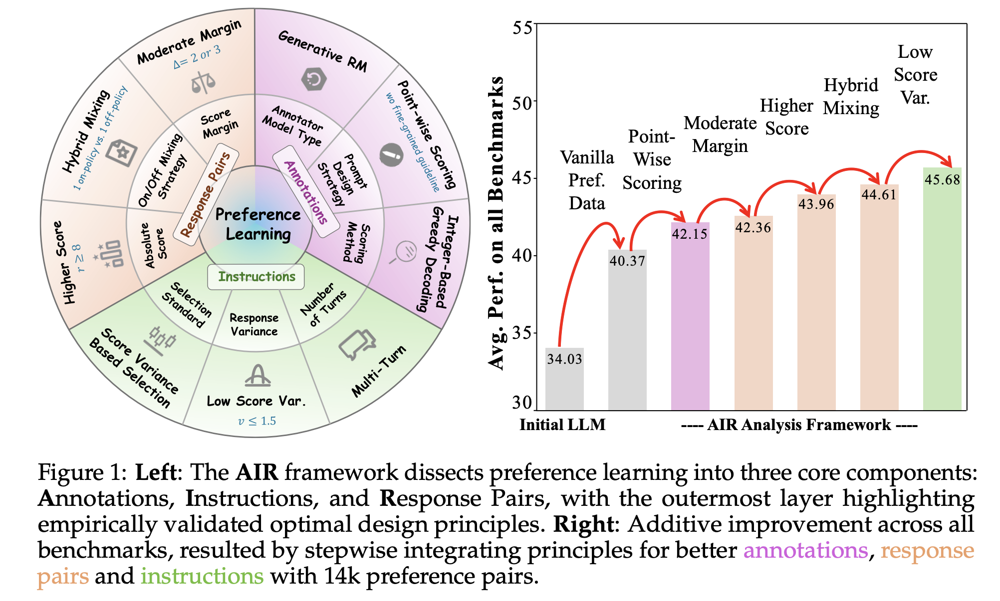
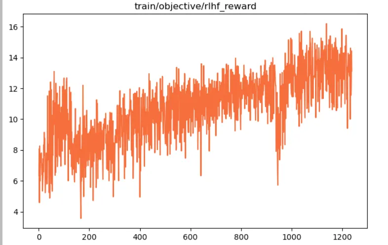
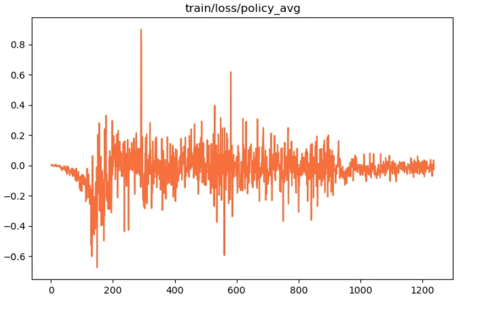
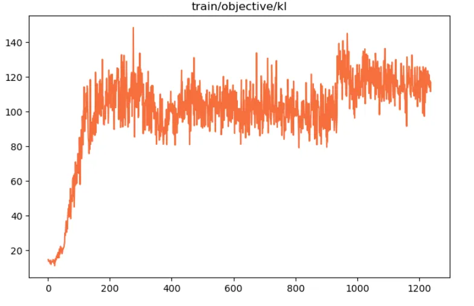
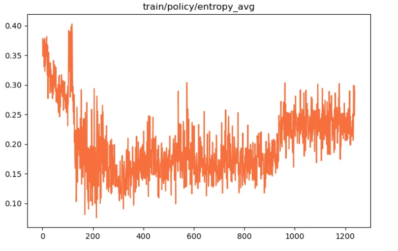

# 民航维修大模型强化学习(RL)
## 背景
民航维修作为严重依赖模型溯因推理能力的应用场景，对强化学习提高推理能力有很高的需求。当以持续预训练的方式步入了垂域知识之后，当以监督微调的方式对齐了模型和民航维修的指令任务，让模型学会如何利用学到的知识之后，更进一步希望模型能完成更高阶的民航维修任务。

此外，在实际以 RAG 或者 DeepSearch ，甚至 DeepResearch 等为解决方案的技术体系中，如何用好外部检索数据，包括各类知识库，如手册、历史维修工单、专业民航维修知识图谱等等，都对模型的推理能力，工具调用能力有较高要求，进一步也对强化学习有进一步需求。

## 强化偏好数据构建思路

### 构建标准

经过调研，拟采用 [AIR 框架](https://arxiv.org/abs/2504.03612)，根据其中的三大设计准则：极简标准策略、智能指令筛选、科学回复对构造，来保障偏好数据的有效性。

AIR 框架(点击查看图片)

 

### 偏好数据

对之前多个预训练产出的模型、监督对齐的模型，结合多样的采样策略，构建偏好数据。

## 强化学习实验

### 探索性实验
#### 实验一：跑通强化学习训练代码

* 数据集：AI-ModelScope/alpaca-gpt4-data-zh#20000
* 经典 PPO 算法，脚本：[rl_ppo.sh](scripts/rl_ppo.sh)
* 实验结果：

    1. 策略模型获得的 Reward 走势正常

        

        
策略模型获得的 Reward (点击查看图片)

        
 

        

    2. Actor 策略网络 loss 走势正常

        

        
策略网络 loss (点击查看图片)

        
 

        

    3. Critic 网络 loss 走势正常

        

        
Critic 网络 loss (点击查看图片)

        
 

        

    4. Actor 策略模型和冻结的 Ref 模型 kl 走势正常

        

        
Actor 策略模型和冻结的 Ref 模型 kl (点击查看图片)

        
 

        

    5. Actor 策略模型的熵值走势正常，整体较低，回复多样性强，没有坍塌到奖励模型

        

        
AActor 策略模型的熵值(点击查看图片)

        
 

        

* 实验结论：
    1. 已快速跑通强化学习训练框架代码，各项指标均正常。
